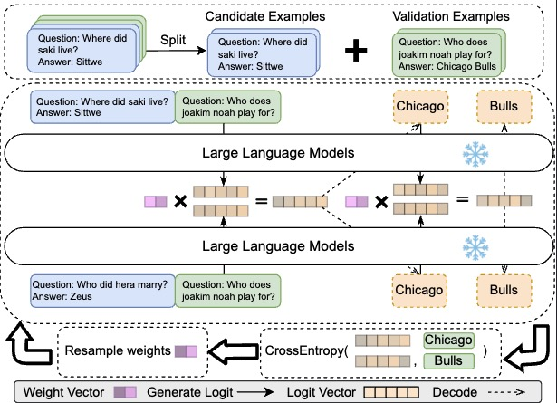

# Divide, Reweight, and Conquer: A Logit Arithmetic Approach for In-Context Learning
This includes the original implementation of "Divide, Reweight, and Conquer: A Logit Arithmetic Approach for In-Context Learning"

LARA is a novel framework that enhances in-context learning by dividing long input demonstrations into shorter, parallelizable subgroups and reweighting their logits using a non-gradient optimization approach.


The LARA framework divides the training examples into multiple subgroups and uses the gradient-free optimization algorithm CMA-ES to generate the weight vector w. 



## Updates
- **2024.10**: Initial release of codes, models, and the paper.

## Content
1. [Installation](#installation)
2. [Quick Start](#quick-start)
3. [Inplement New Tasks](#inplement-new-tasks)
4. [Baselines](#baselines)
5. [Acknowledgement](#acknowledgement)
6. [Contact](#contact)


## Installation


Install dependent Python libraries by running the command below.

```
pip install -r requirements.txt
```

Alternatively, create a conda environment by running the command below:

```
conda env create -f environment.yml
```

## Quick Start
To run the main experiments, use the following commands:
```
## BBH B-LARA
python hyper_search_loss.py --model meta-llama/Meta-Llama-3.1-8B --output_path llama31 --dataset_name BBH --subdataset_name date_understanding --train_length 32 --binary

## MMLU
python hyper_search_loss.py --model meta-llama/Meta-Llama-3.1-8B --output_path llama31 --dataset_name MMLU --subdataset_name anatomy --train_length 32

## GoEmotion B-LARA
python hyper_search_loss.py --model meta-llama/Meta-Llama-3.1-8B --output_path llama31 --dataset_name emotion  --train_length 8 --binary

## Tacred
python hyper_search_loss.py --model meta-llama/Meta-Llama-3.1-8B --output_path llama31 --dataset_name tacred  --train_length 8
```

## Inplement New Tasks

To implement LARA for a new dataset, follow these steps:
1. Add the dataset loader in `data_set.py` by implementing a new class.
```python
class Example_Dataset(Dataset):
    def __init__(self,path,train_length = 64):
        super().__init__()
        self.train = [{'input':'What is the paper mainly about?','output':'A novel efficient inference framework'}]
        self.train = [{'input':'What is the name of the framework?','output':'LARA'}]

```

2. Implement the evaluation metrics in `results.py`.

```python
class Example_Results(Results):
    def post_processing(self):
        candidates = ['A','B','C','D']
        for i in range(len(self.results)):
            truth = self.results[i]['truth']
            output = self.results[i]['output']
            try:
                output = output.split('Question')[0]
            except:pass
            answer_output = None
            for answer in candidates:
                if output in answer or answer in output:
                    answer_output = answer
                    break
            try:
                self.results[i]['answer'] = answer_output.upper()
            except:self.results[i]['answer'] = ''

    def calculate_score(self):
        self.post_processing()
        count = 0
        for result in self.results:
            if result['truth']==result['answer']:count+=1
        return count/len(self.results)

```


3. Add the prompts in `prompt.py`, including the template to transform data to demostrations like
```python
def get_example_prompt(datas, subject=None):
    ans = ''
    for data in datas:
        ans += f"Question: {data['input']}\nAnswer: {data['output']}\n\n"
    return ans
```

And define the prompt for question answering. Here, `formula_string` represents the prompted in-context examples:
```python
prompt_templates = {"example":lambda formula_string, input_string: f"{formula_string}Question: {input_string}\nAnswer:"}
```
Also, add your prompt in `prompt.py`:
```python
prompts = {'example':get_example_prompt}
```

4. Add all these things in `utils.py`
```python 
def get_path_dataset(output_path,dataset_name,subdataset_name,train_length):
    if dataset_name == 'example':
        dataset = Example_Dataset(subdataset_name,train_length)
        filepath = f'results/{output_path}/{dataset_name}/{subdataset_name}/'

def get_results(dataset_name,results):
    if dataset_name == 'example': 
        results = Example_Results(results)
```

## Baselines
The main code also provides ICL baseline results. The KATE results can be obtained by running `retrieve_baseline.py`:
```bash
python retrieve_baseline.py --dataset_name BBH
```
The ablation study can be conducted using `nonreweight.py`:
```
python nonreweight.py --dataset_name BBH`
```

## Acknowledgement
The code base comes from https://github.com/eth-sri/language-model-arithmetic. We are very grateful to the author for providing an excellent code base to implement LARA. We also thank the open-source non-gradient optimization library, https://github.com/facebookresearch/nevergrad.


## Contact
If you have questions, please open an issue or send an email to chengsong[at]wustl.edu.

