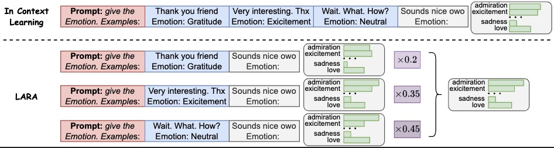

# Divide, Reweight, and Conquer: A Logit Arithmetic Approach for In-Context Learning
This includes the original implementation of Divide, Reweight, and Conquer: A Logit Arithmetic Approach for In-Context Learning

LARA is a novel framework that enhances in-context learning by dividing long input demonstrations into shorter, parallelizable subgroups and reweighting their logits using a non-gradient optimization approach.




Main experiment can be run like 
```
python language-model-arithmetic/hyper_search_loss.py --model meta-llama/Meta-Llama-3.1-8B --output_path llama31 --dataset_name BBH --subdataset_name date_understanding --train_length 32
```

The BBH and MMLU data come from `Chain-of-Thought Hub`